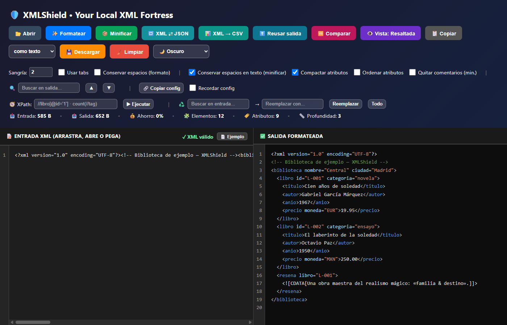

# 🛡️ XMLShield - Your Local XML Fortress

> **Privacy-first XML formatter. 100% local, zero dependencies, zero compromise.**

XMLShield es una herramienta de formateo y minificación de XML que funciona completamente en tu navegador, sin enviar datos a ningún servidor. Diseñada en respuesta a preocupaciones sobre la seguridad de herramientas online, XMLShield te da control total sobre tus archivos XML sensibles.

---

## ✨ Características Principales

### 🔐 Seguridad y Privacidad
- ✅ **100% Local** - Funciona completamente offline
- ✅ **Cero Dependencias** - Sin CDN, npm o código de terceros
- ✅ **Sin Telemetría** - No envía datos a ningún servidor
- ✅ **Auditable** - Todo el código en un solo archivo de ~50KB
- ✅ **No requiere instalación** - Abre y usa

### ⚡ Funcionalidades
- ✨ **Formateo XML** con indentación configurable (espacios o tabs)
- 📦 **Minificación inteligente** con opciones avanzadas
- 🎨 **Resaltado de sintaxis** sin dependencias externas
- 👁️ **Vista dual** - Texto plano o sintaxis resaltada
- 📊 **KPIs en tiempo real** - Tamaño entrada/salida/ahorro
- 💾 **Descarga de resultados** con timestamp
- 📋 **Copiar al portapapeles** con un click
- 🌓 **Modo oscuro/claro** para comodidad visual
- ⌨️ **Atajos de teclado** para flujo de trabajo rápido
- 🎯 **Drag & drop** - Arrastra archivos .xml directamente

### 🎨 Interfaz
- Panel dividido lado a lado
- Gradientes modernos
- Responsive design (móvil/tablet/desktop)
- Feedback visual en todas las acciones

---

## 📖 Inicio Rápido

## 📸 Vista Previa

  
  
<em>XMLShield formateando XML con resaltado de sintaxis en modo oscuro</em>

### Método 1: Uso Directo (Recomendado)
1. Descarga `index.html`
2. Abre con doble clic (no requiere servidor web)
3. Pega tu XML o arrastra un archivo
4. ¡Listo! Formatea o minifica con un click

### Método 2: Desde el Navegador
1. Ve a `https://luisfemojica.github.io/xmlshield/`
2. Agrega a favoritos para uso offline
3. Funciona sin conexión después de la primera carga

### Operaciones Básicas

#### Formatear XML
1. Pega tu XML en el panel izquierdo
2. Ajusta sangría (espacios o tabs)
3. Click en "✨ Formatear" o presiona `Ctrl+Enter`
4. Resultado aparece en panel derecho

#### Minificar XML
1. Pega tu XML en el panel izquierdo
2. Configura opciones de minificado
3. Click en "📦 Minificar" o presiona `Ctrl+M`
4. XML comprimido aparece a la derecha

#### Descargar Resultado
- Click en "💾 Descargar"
- Se descarga como: `xml_formatted_[timestamp].xml`

---

## ⌨️ Atajos de Teclado

| Atajo | Acción |
|-------|--------|
| `Ctrl + Enter` | Formatear XML |
| `Ctrl + M` | Minificar XML |
| `Ctrl + B` | Cambiar vista (Texto/Resaltada) |
| `Ctrl + Z` | Deshacer (fuera del editor) |
| `Ctrl + Y` | Rehacer (fuera del editor) |

---

## ⚙️ Opciones Avanzadas

### Configuración de Formato
- **Sangría (0-16):** Define número de espacios de indentación
- **Usar tabs:** Checkbox para usar tabuladores en lugar de espacios
- **Conservar espacios:** No normaliza espacios en nodos de texto al formatear

### Configuración de Minificado
- **Conservar espacios en texto:** No modifica espacios dentro de contenido textual
- **Compactar atributos:** Elimina espacios redundantes en atributos

---

## 🎯 Casos de Uso

XMLShield está diseñado para:

- ✅ **Desarrolladores** formateando XMLs de configuración (Spring, Maven, web.xml)
- ✅ **Analistas de datos** limpiando exportaciones XML de APIs o bases de datos
- ✅ **SysAdmins** validando archivos de configuración antes de deploy
- ✅ **Estudiantes** aprendiendo XML y visualizando estructura
- ✅ **Equipos con datos sensibles** (GDPR, HIPAA) que no pueden usar herramientas cloud
- ✅ **Cualquier persona** que valore privacidad sobre conveniencia

### ✅ Casos Primarios (Funciona Perfecto)
- XMLs de configuración (<5MB)
- Exportaciones de APIs o bases de datos
- Archivos de infraestructura sensibles
- Validación de sintaxis XML
- Aprendizaje y experimentación

### 🟡 Casos Secundarios (Funciona con Limitaciones)
- XMLs muy grandes (>100MB) - Puede ser lento pero funciona
- Archivos complejos sin validación XSD (solo valida sintaxis)

### ❌ Casos NO Cubiertos (Por Diseño)
- Validación contra schemas XSD/DTD → Usar herramientas especializadas
- Transformaciones XSLT complejas → Fuera del alcance
- Procesamiento batch automatizado → No es una CLI tool

---

## 🔐 Seguridad y Privacidad

### Garantías de Seguridad

✅ **Sin conexión a Internet** - El archivo funciona completamente offline  
✅ **Sin telemetría** - No envía datos a ningún servidor  
✅ **Sin cookies** - No almacena ni rastrea información  
✅ **Sin CDN** - No carga recursos externos que puedan ser comprometidos  
✅ **Código auditable** - Todo el código está en un solo archivo visible (~500 líneas)  
✅ **Sin dependencias** - Cero librerías de terceros que puedan tener vulnerabilidades  

### Consideraciones

- ⚠️ Los archivos procesados quedan en la memoria del navegador hasta cerrar la pestaña
- ⚠️ No hay límite de tamaño, pero archivos muy grandes (>100MB) pueden ralentizar el navegador
- ✅ Compatible con normativas de privacidad (GDPR, HIPAA, etc.) por ser 100% local

### Contexto: ¿Por Qué XMLShield?

En febrero de 2026, Notepad++ sufrió un incidente de seguridad que comprometió la confianza en herramientas que dependen de actualizaciones automáticas y CDNs externos. XMLShield nace como respuesta a esta necesidad: una herramienta que puedes auditar visualmente en minutos y usar con confianza total.

---

## 📐 Alcance y Filosofía del Proyecto

### Principios Fundamentales

XMLShield v2.x se adhiere estrictamente a estos principios:

1. **Un solo archivo HTML** - Facilita distribución, auditoría y uso offline
2. **Cero dependencias externas** - Sin CDN, npm, ni código de terceros
3. **Auditable en minutos** - Cualquier desarrollador puede revisar todo el código
4. **Funciona offline** - Sin conexión a internet requerida
5. **Sin telemetría** - Cero rastreo, cero cookies, cero envío de datos

### Límites Técnicos (v2.x)

Para mantener la simplicidad y auditabilidad:

| Aspecto | Límite Actual v2.0 | Límite Máximo v2.x |
|---------|-------------------|-------------------|
| **Líneas de código** | ~500 | 800 |
| **Tamaño del archivo** | ~50KB | 100KB |
| **Tiempo de auditoría** | ~15 minutos | 30 minutos |
| **Dependencias externas** | 0 | 0 |

### Test de 4 Preguntas

Toda nueva feature debe pasar **mínimo 3 de 4** preguntas:

1. ✅ ¿Lo necesita el 80% de los usuarios?
2. ✅ ¿Se puede implementar en <200 líneas?
3. ✅ ¿Mantiene el archivo auditable visualmente?
4. ✅ ¿Funciona 100% offline sin setup?

---

## 🗺️ Roadmap

### v2.0 - "The Foundation" ✅ ACTUAL
**Fecha:** Febrero 2026

Refactorización completa con diseño moderno, panel dividido, gradientes, modo oscuro mejorado, KPIs con emojis, y descarga de archivos.

### v2.1 - "Quick Wins" 🔨 EN PROGRESO
**Fecha estimada:** Marzo-Abril 2026

- ✅ Errores detallados con número de línea ← **Implementado**
- ✅ Undo/Redo básico (memoria de sesión) ← **Implementado**
- 🔲 Estadísticas del documento (elementos, profundidad, atributos)
- 🔲 Líneas numeradas en editores
- ✅ Advertencia para archivos grandes (>50MB)

**Impacto:** +100-150 líneas | ~60KB total

### v2.2 - "Productivity Boost" 📅 Q2-Q3 2026
**Fecha estimada:** Mayo-Julio 2026

- 🔲 Conversión XML ↔ JSON
- 🔲 Búsqueda mejorada con highlight
- 🔲 Presets de configuración vía URL
- 🔲 Copiar como string escapado (JS, Python, Java)

**Impacto:** +150-250 líneas | ~75-80KB total

### v2.3 - "Navigation & UX" 📅 Q4 2026
**Fecha estimada:** Octubre-Diciembre 2026

- 🔲 Vista de árbol colapsable (solo lectura)
- 🔲 Ir a línea específica (Ctrl+G)
- 🔲 Temas visuales adicionales (High Contrast, Solarized, Monokai)

**Impacto:** +200-300 líneas | ~95-100KB total (límite máximo v2.x)

### v3.0+ - "XMLShield Extended" 🔮 2027+
**Proyecto separado** con features avanzadas:
- Validación XSD básica
- Diff/comparación de XMLs
- XPath queries simples
- Web Workers para procesamiento

---

## 📚 Documentación Completa

Este proyecto mantiene documentación exhaustiva para guiar su desarrollo:

### 📄 Documentos Principales

- **[SCOPE.md](docs/SCOPE.md)** - ⭐ **Definición de Alcance**
  - Qué está dentro y fuera de XMLShield v2.x
  - Límites técnicos estrictos
  - Test de 4 Preguntas para evaluar features
  - Casos de uso cubiertos y no cubiertos

- **[ROADMAP.md](docs/ROADMAP.md)** - 📅 **Plan de Versiones**
  - Timeline detallado (v2.1, v2.2, v2.3)
  - Features planificadas con estimaciones
  - Criterios de éxito por versión
  - Métricas de progreso

- **[CONTRIBUTING.md](CONTRIBUTING.md)** - 🤝 **Guía de Contribución**
  - Cómo proponer features
  - Guías de código y estándares
  - Templates para Issues y PRs
  - Proceso de contribución

- **[GUIA_DOCUMENTACION.md](docs/GUIA_DOCUMENTACION.md)** - 📚 **Índice de Documentación**
  - Cómo usar cada documento
  - Escenarios comunes
  - Checklist de contribución

### 🎯 ¿Por Dónde Empezar?

**Si quieres usar XMLShield:**
- Lee este README.md completo
- Descarga `index.html` y úsalo

**Si quieres contribuir:**
1. Lee [SCOPE.md](docs/SCOPE.md) - Entiende la filosofía
2. Revisa [ROADMAP.md](docs/ROADMAP.md) - Ve qué está planificado
3. Sigue [CONTRIBUTING.md](CONTRIBUTING.md) - Aprende el proceso

**Si tienes una idea de feature:**
1. Aplica el Test de 4 Preguntas (en SCOPE.md)
2. Revisa si ya está en el ROADMAP
3. Abre un Issue siguiendo el template

---

## 🚀 Mejoras Futuras Consideradas

### ✅ En Roadmap (v2.1-v2.3)
- Errores con número de línea
- Estadísticas del documento
- Conversión XML ↔ JSON
- Vista de árbol navegable
- Temas adicionales

### 🤔 Bajo Evaluación (v3.0+)
- Validación XSD (requiere ~2000+ líneas)
- Comparación/Diff de XMLs
- XPath queries básicos
- PWA (Progressive Web App)

### ❌ Explícitamente FUERA del Alcance (v2.x)
- Soporte DTD (legacy, complejo)
- XSLT transformations (requiere motor completo)
- Web Workers (rompe concepto de un solo archivo)
- Múltiples pestañas (state management complejo)
- Sistema de plugins (rompe simplicidad)
- Aplicaciones nativas (Electron, CLI, extensión)

**¿Por qué tan restrictivo?** La simplicidad ES nuestra feature principal. XMLShield v2.x debe "simplemente funcionar" para el 95% de casos sin explicaciones, curva de aprendizaje, o riesgos de seguridad.

Para features más avanzadas, considera XMLShield Extended (v3.0+) o herramientas enterprise como Oxygen XML o XMLSpy.

---

## 💻 Compatibilidad

### Navegadores Soportados
- ✅ Chrome 90+
- ✅ Firefox 88+
- ✅ Safari 14+
- ✅ Edge 90+

### No Soportado
- ❌ Internet Explorer (obsoleto)
- ❌ Navegadores muy antiguos (>3 años)

### Características Usadas
- DOMParser API (validación XML nativa)
- XMLSerializer API (serialización)
- Clipboard API (copiar al portapapeles)
- File API (drag & drop)
- CSS Grid y Flexbox (layout moderno)

---

## 📝 Changelog

### v2.1 - Marzo 2026 (En progreso)
- ✅ Errores XML con número de línea y columna exactos
- ✅ Undo/Redo básico con Ctrl+Z / Ctrl+Y (memoria de sesión)

### v2.0 - Febrero 2026
- ✅ Refactorización completa del diseño
- ✅ Panel dividido lado a lado
- ✅ Gradientes modernos en header
- ✅ Botón de descarga de archivos
- ✅ Mejoras en modo oscuro
- ✅ Responsive design mejorado
- ✅ KPIs con emojis
- ✅ Feedback visual en acciones

### v1.0 - Febrero 2026 (Original)
- ✅ Formateo XML con DOMParser
- ✅ Minificación inteligente
- ✅ Resaltado de sintaxis
- ✅ Vista alternativa texto/resaltada
- ✅ Drag & drop
- ✅ KPIs en tiempo real
- ✅ Modo oscuro
- ✅ 3 atajos de teclado

---

## 🤝 Contribuciones

Este proyecto valora las contribuciones que mantienen su filosofía de simplicidad y seguridad.

### ¿Cómo Contribuir?

1. **Lee la documentación:**
   - [SCOPE.md](docs/SCOPE.md) - Entiende qué está en alcance
   - [ROADMAP.md](docs/ROADMAP.md) - Ve qué está planificado
   - [CONTRIBUTING.md](CONTRIBUTING.md) - Sigue el proceso

2. **Verifica el alcance:**
   - Aplica el Test de 4 Preguntas
   - ¿Pasa 3/4? → Continúa
   - ¿No pasa? → Considera XMLShield Extended (v3.0+)

3. **Propón tu idea:**
   - Abre un Issue con el template
   - Espera feedback del mantenedor
   - Si es aceptada, implementa siguiendo las guías

### Reglas para Contribuciones

- ✅ Mantener el principio de "un solo archivo HTML"
- ✅ No agregar dependencias externas (CDN, npm, etc.)
- ✅ Mantener compatibilidad con navegadores modernos
- ✅ Documentar cambios en el código
- ✅ Actualizar el Changelog
- ✅ No exceder límites: 800 líneas, 100KB

### Reconocimiento

Los contribuidores son reconocidos en:
- Esta sección del README
- Changelog de cada versión
- Comentarios del código (si aplica)

**Contribuidores actuales:**
- **Luis Mojica** - Creador y mantenedor principal

---

## 📄 Licencia

Este proyecto está en el **dominio público**. Úsalo libremente para cualquier propósito personal o comercial sin restricciones.

**Disclaimer:** Este software se proporciona "tal cual", sin garantías de ningún tipo, expresas o implícitas.

---

## 📚 Referencias y Recursos

### Documentación Relevante
- [MDN - DOMParser](https://developer.mozilla.org/en-US/docs/Web/API/DOMParser)
- [MDN - XMLSerializer](https://developer.mozilla.org/en-US/docs/Web/API/XMLSerializer)
- [W3C - XML 1.0 Specification](https://www.w3.org/TR/xml/)

### Contexto de Seguridad
- Notepad++ Hijacking Incident (Febrero 2026)
- Supply Chain Attack Best Practices
- Local-First Software Movement

### Herramientas Relacionadas
- **Para validación XSD:** XMLSpy, Oxygen XML Editor
- **Para XSLT:** xsltproc, Saxon
- **Para procesamiento batch:** xmllint, tidy

---

## 💡 Preguntas Frecuentes (FAQ)

### ¿Es realmente seguro usar XMLShield con datos sensibles?
**Sí.** Todo el procesamiento ocurre en tu navegador. No se envía ningún dato a servidores externos. Puedes verificarlo auditando el código (son solo ~500 líneas) o monitoreando el tráfico de red (verás cero requests).

### ¿Por qué no usar herramientas online como prettydiff.com o xmlformatter.io?
Esas herramientas envían tu XML a sus servidores. Si trabajas con datos sensibles, regulados o confidenciales, esto puede violar políticas de privacidad o compliance.

### ¿Funciona sin internet?
**Sí, 100%.** Después de descargar `index.html`, puedes usarlo completamente offline. No requiere conexión a internet en ningún momento.

### ¿Por qué no añaden validación XSD?
Añadir un validador XSD completo requeriría ~2000+ líneas de código, rompiendo nuestro principio de simplicidad y auditabilidad. Para eso existen herramientas especializadas. XMLShield se enfoca en hacer una cosa muy bien: formatear y minificar XML de forma segura.

### ¿Puedo usar XMLShield en mi empresa?
**Absolutamente.** Al ser dominio público y 100% local, cumple con la mayoría de políticas de seguridad corporativa. Muchas empresas lo prefieren sobre herramientas cloud para archivos de configuración sensibles.

### ¿Qué pasa con archivos XML muy grandes (>100MB)?
XMLShield puede procesarlos, pero puede ser lento ya que todo ocurre en memoria del navegador. Para archivos enormes, considera herramientas de línea de comandos como `xmllint` o `tidy`.

### ¿Por qué un solo archivo HTML en lugar de un proyecto npm normal?
**Simplicidad y seguridad.** Un solo archivo es:
- Fácil de distribuir (email, USB, intranet)
- Fácil de auditar (lees todo en 30 minutos)
- Sin proceso de build que pueda ser comprometido
- Sin dependencias que puedan tener vulnerabilidades

### ¿Puedo hacer un fork con más features?
**¡Por supuesto!** Solo mantén claro que es un fork y respeta la licencia de dominio público. Si añades features complejas (XSD, XSLT, etc.), considera llamarlo "XMLShield Extended" para diferenciarlo.

---

## 🎯 Filosofía Final

> XMLShield existe porque creemos que las herramientas de desarrollo no deberían 
> comprometer tu privacidad ni la de tus usuarios. En un mundo donde incluso 
> editores de texto pueden ser comprometidos, necesitamos herramientas que 
> podamos auditar, entender y confiar.

**Simplicidad no es una limitación, es nuestra característica principal.**

---

## 📞 Contacto y Soporte

- **Issues:** Para reportar bugs o proponer features
- **Discussions:** Para preguntas generales e ideas
- **Website:** luisfemojica.com
- **Email:** Disponible en el website

---

## 🌟 Apoya el Proyecto

XMLShield es gratuito y de código abierto. Si te resulta útil:

- ⭐ Dale una estrella en GitHub
- 🐛 Reporta bugs que encuentres
- 💡 Propón mejoras (que respeten el alcance)
- 📢 Compártelo con colegas que valoren privacidad
- 📝 Mejora la documentación
- 🤝 Contribuye código siguiendo las guías

**No aceptamos donaciones.** Preferimos contribuciones de código o documentación.

---

**Última actualización:** Marzo 2026
**Versión:** 2.1 (en progreso)
**Autor:** Luis Mojica  
**Licencia:** Dominio Público  

---

**🛡️ Privacy First. Security First. Simplicity First. 🛡️**

Made with ❤️ for developers who value privacy

